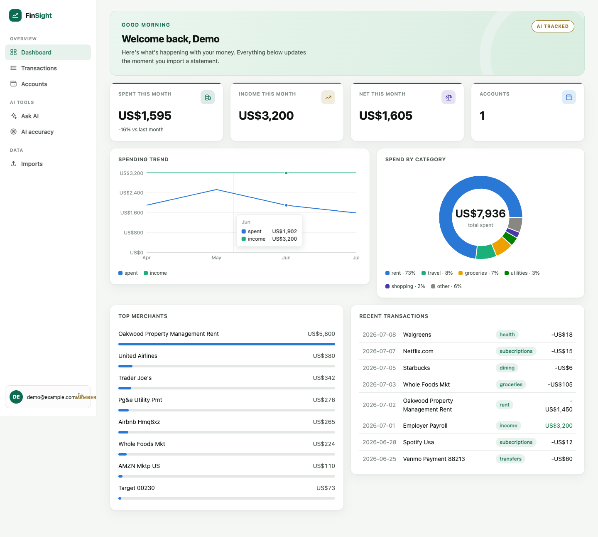
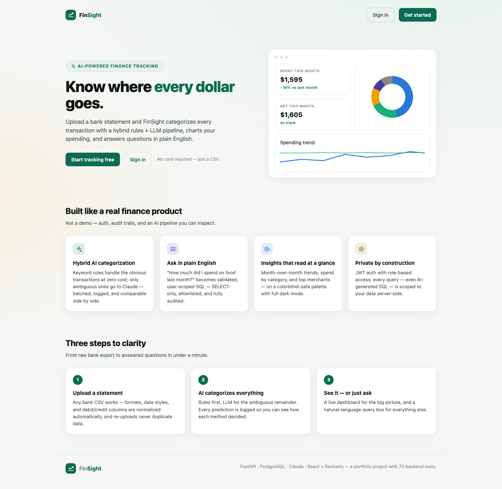
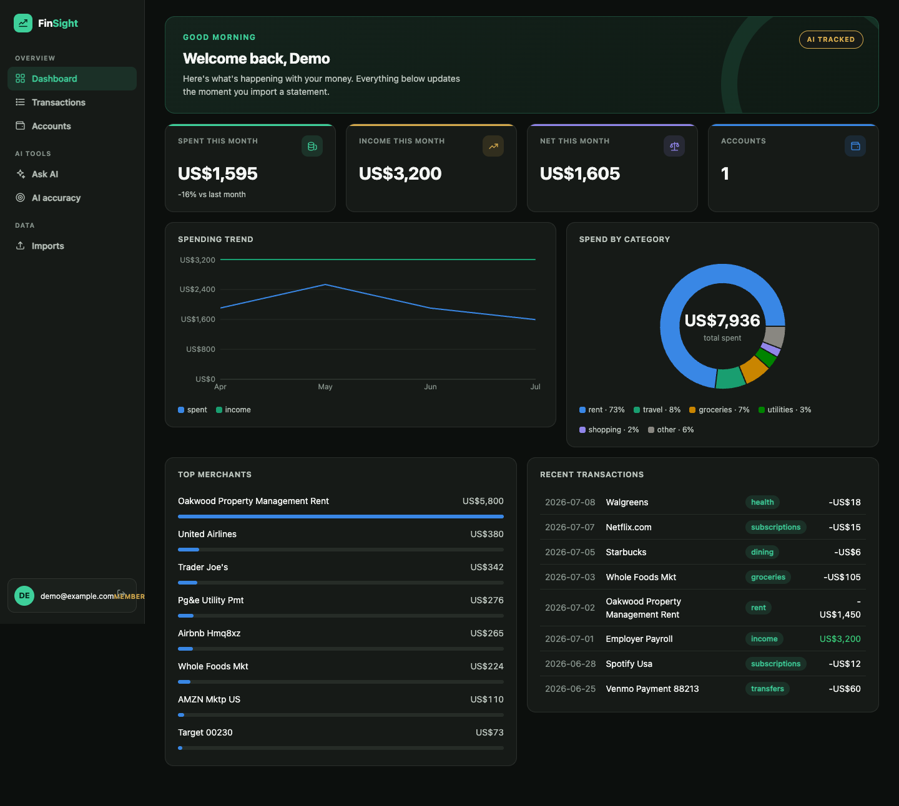
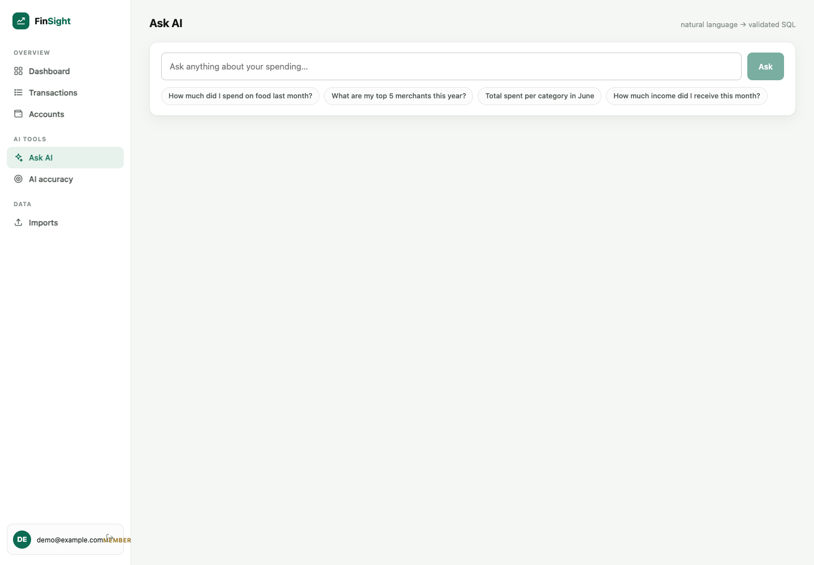
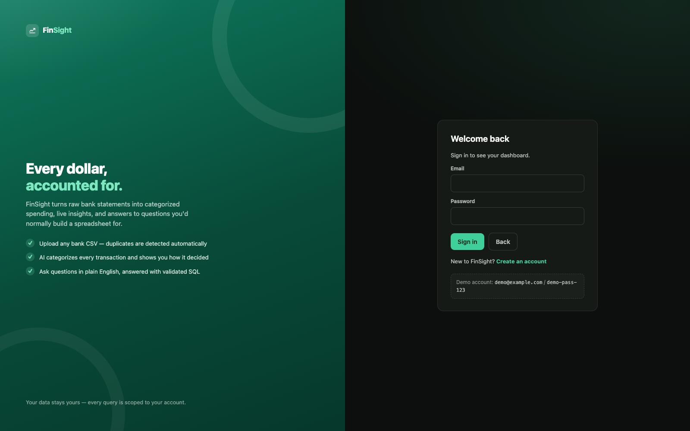

# FinSight — Personal Finance AI Tracker

Upload a bank statement, and FinSight categorizes every transaction with a **hybrid rules + LLM pipeline**, charts your spending, and answers questions in plain English via **validated text-to-SQL**.

Backend-first portfolio project: FastAPI · SQLAlchemy 2.0 · **PostgreSQL + MongoDB** (polyglot persistence) · pluggable LLM provider (Claude / Gemini / Groq / Ollama) · React + TypeScript + Recharts. **78 backend tests**, zero-infrastructure test suite.



<details>
<summary>More screenshots (landing page, dark mode, Ask AI, login)</summary>






</details>

## What it does

- **CSV statement import** — column names, date formats, `$1,234.56`/`(45.00)` amounts, and debit/credit-pair layouts are all normalized to one canonical shape (signed amount, negative = money out). Imports are idempotent: every row gets a content-based dedup hash, so re-uploading a statement never duplicates data.
- **Hybrid AI categorization** — a zero-cost keyword classifier settles unambiguous merchants instantly; only low-confidence transactions go to Claude (Haiku), **batched ~20 per call** with schema-validated structured output. Every prediction from *both* methods is persisted, powering a rule-vs-LLM comparison view and agreement-rate stats.
- **Insights API + dashboard** — spend by category, month-over-month trend, top merchants; rendered as a donut, trend line, and ranked bars on a colorblind-safe palette with full dark mode.
- **Ask AI (text-to-SQL)** — "how much did I spend on food last month?" → Claude proposes SQL → the server distrusts it completely (see below) → results + the generated SQL + a full query audit trail in the UI.
- **Auth & multi-tenancy** — JWT with RBAC scaffolding; every table and every query (including AI-generated SQL) is scoped per user.

## Design decisions worth asking me about

1. **Rules first, LLM second.** ~80 keyword rules each carry their own confidence; ambiguous merchants (`venmo`, `paypal`, `amazon`) are deliberately scored below the threshold so they route to the LLM. One LLM call per ~20 transactions instead of per transaction is a ~20× cost/latency win. If the LLM is down or unconfigured, weak rule matches are used as a fallback — an outage never stalls an import.
2. **The LLM only proposes SQL; nothing it produces is trusted.** Generated SQL is parsed with sqlglot, rejected unless it's a single plain SELECT over allowlisted tables, then every table reference is rewritten to a CTE pre-filtered to the current user (so even a query with no user filter can only see that user's rows), and a row cap is injected. Every attempt — including rejections — is audited in `nl_queries`.
3. **`NUMERIC` money, portable column types.** Amounts are `NUMERIC(12,2)`, never floats. Column types (`Uuid`, string-backed enums, `JSON`) are chosen so the same models run on Postgres in dev/prod and in-memory SQLite in tests — `pytest` needs zero infrastructure.
4. **Dedup without bank transaction IDs.** Hash of `date|amount|merchant|description|ordinal`, where the ordinal disambiguates identical rows within one file: re-uploads are fully idempotent while two identical same-day coffees both survive. The residual limitation (overlapping statement exports) is documented in code.
5. **Dual-prediction audit log.** `categorization_results` stores what the rules *and* the LLM each predicted, independent of which won — that's what makes the "AI accuracy" page (agreement rate, who-decided breakdown) possible.
6. **Polyglot persistence, each store doing what it's for.** PostgreSQL is the system of record (relational ledger, auth, decision audit tables). MongoDB holds **AI call telemetry** (`ai_events` collection: provider, model, batch sizes, latencies, raw payloads) — schema-flexible, append-only event data whose shape varies by provider. Telemetry is best-effort by design: if Mongo is down or unconfigured, requests proceed untouched (`GET /ai/events` reports `enabled: false`).

## Setup

Requires Python 3.11+, Node 18+, and Docker (for Postgres).

```bash
# Backend
cd backend
docker compose up -d                      # Postgres 16 + MongoDB 7
python3 -m venv .venv && source .venv/bin/activate
pip install -r requirements.txt
cp .env.example .env                      # set JWT_SECRET_KEY + ANTHROPIC_API_KEY
alembic upgrade head                      # tables + seeded categories
uvicorn app.main:app --reload             # API on :8000, docs at /docs

# Frontend (second terminal)
cd frontend
npm install
npm run dev                               # dashboard on :5173
```

### LLM provider (free options supported)

The two AI features run against a **pluggable provider** behind dependency-injected interfaces:

- `LLM_PROVIDER=anthropic` (default) — Claude Haiku, ~pennies per session.
- `LLM_PROVIDER=openai` — any OpenAI-compatible endpoint: **Google Gemini (free tier)**, **Groq (free tier)**, **Ollama (fully local, no key)**, or OpenAI itself. See [.env.example](backend/.env.example) for the exact base-URL/model combos.

Without any key, categorization degrades gracefully to rules-only and Ask AI returns a clear 503 — everything else works.

## Tests

```bash
cd backend && pytest    # 78 tests, in-memory SQLite + fake Mongo, no services needed
```

Coverage: CSV parsing/normalization (11), dedup semantics, auth + RBAC (11), upload idempotency (8), the categorization pipeline with a faked LLM (13), insights aggregation (7), NL-to-SQL validation & injection attempts (17), the OpenAI-compatible provider (4), Mongo telemetry with a fake collection (4), and model/schema smoke tests.

## API surface

| Endpoint | Purpose |
|---|---|
| `POST /auth/register` · `POST /auth/login` · `GET /auth/me` | JWT auth; `GET /auth/users` is admin-only (RBAC) |
| `POST /accounts` · `GET /accounts` | Bank/card accounts |
| `POST /uploads` · `GET /uploads` | CSV import (multipart) + batch history with dedup stats |
| `GET /transactions` | Paginated, filterable, user-scoped |
| `GET /transactions/{id}/categorization` | Rule-vs-LLM prediction history for one transaction |
| `POST /categorization/run` · `GET /categorization/stats` | Run the pipeline; agreement-rate stats |
| `GET /categories` | System + user categories |
| `GET /insights/by-category` · `/monthly` · `/top-merchants` | Aggregates behind the dashboard charts |
| `POST /nlq` · `GET /nlq/history` | Natural-language query + audit trail |
| `GET /ai/events` | Raw LLM call telemetry from MongoDB (provider, model, latency per call) |

## Database schema

| Table | Purpose |
|---|---|
| `users` | Auth + RBAC (`user`/`admin`) |
| `accounts` | Accounts per user |
| `categories` | System-seeded + user-defined categories |
| `import_batches` | One row per upload: totals, duplicates, status, errors |
| `transactions` | Signed `NUMERIC` amounts, dedup hash, final category + decision source |
| `categorization_results` | Audit log of every rule/LLM prediction |
| `nl_queries` | Audit log of every NL→SQL attempt (executed / rejected / failed) |

**MongoDB** (`finsight.ai_events` collection): one document per LLM call — categorization batches and NLQ generations with provider, model, batch size, latency, and status. Optional; the app runs fully without it.

## Project structure

```
backend/
├── app/
│   ├── core/                 # config, JWT/bcrypt, auth dependencies
│   ├── db/                   # SQL engine/session + MongoDB client
│   ├── models/               # SQLAlchemy 2.0 models
│   ├── schemas/              # Pydantic request/response models
│   ├── api/                  # thin routers: auth, accounts, uploads,
│   │                         #   transactions, categorization, insights, nlq
│   └── services/
│       ├── csv_parser.py     # format detection + normalization
│       ├── dedup.py          # content hashing with same-day ordinals
│       ├── categorization/   # rules.py · llm.py · pipeline.py
│       ├── insights.py       # dialect-portable aggregates
│       ├── nl_to_sql.py      # generation + validation + scoping
│       └── ai_telemetry.py   # LLM call events → MongoDB (best-effort)
├── alembic/                  # migrations (initial schema seeds categories)
└── tests/                    # 74 tests, LLM faked via dependency injection
frontend/
└── src/
    ├── api.ts                # typed client, JWT handling
    ├── components/           # Landing, Login, Shell (sidebar), charts
    └── components/pages/     # Dashboard, Transactions, Accounts,
                              #   Imports, Ask AI, AI accuracy
```
